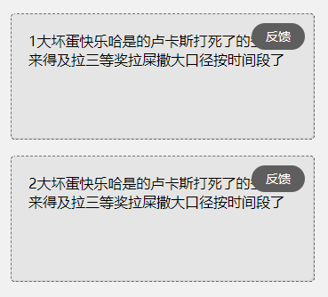

## labc-feedback



## How to use
1.  repo

```
git clone git@github.com:mdzz1/labc-feedback.git
```

2. Require labc-feedback  js file.

```
<script src="./labc-feedback/labc-feedback.min.js"></script>
```

---

## API

### labcFeedback.init(Object)
Initialize labc-feedback

name         | type     | required | description
------------ | -------- | -------- | ---------
class        | Stirng   | Yes      | 可以反馈的对象classname
back         | Function | Yes      | 点击回调


#### Usage

```
labcFeedback.init({
   class: 'feedback',
   back: function(canvas) {} //返回当前页面对象的canvas
})
```

### labcFeedback.enable()
启用（添加反馈蒙层）

#### Usage

```
labcFeedback.disable()
```

### labcFeedback.disable()
禁用（删除反馈蒙层）

#### Usage

```
labcFeedback.disable()
```
